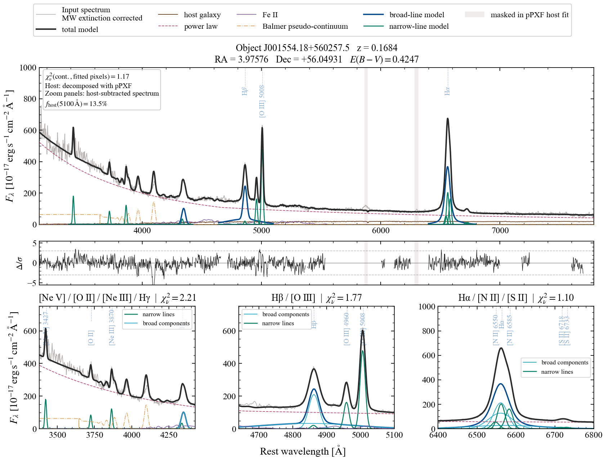

Fit J001554.18+560257.5
========================

This example adapts the single-object qsofitmore tutorial to qsospec. The
quasar was observed with the Lijiang 2.4 m Telescope and belongs to the sample
of Galactic-plane quasars in `Fu et al. (2022)
<https://ui.adsabs.harvard.edu/abs/2022ApJS..261...32F/abstract>`_. Its
relatively large :math:`E(B-V)` is expected from that Galactic-plane
selection.

Prerequisites
-------------

Configure the Planck GNILC map as described in
:doc:`../getting_started/dustmaps`. Download the example
:download:`CSV spectrum <../../examples/data/spec_J001554.18+560257.5_LJT.csv>`
or run the example from a qsospec source checkout.

Fit and archive the spectrum
----------------------------

The CSV stores observed wavelength in Angstrom and flux density and
uncertainty in physical cgs units. These arrays have not been corrected for
foreground Galactic extinction.

.. code-block:: python

   from pathlib import Path

   import pandas as pd
   import qsospec

   data_path = Path(
       "examples/data/spec_J001554.18+560257.5_LJT.csv"
   )
   table = pd.read_csv(data_path)

   spectrum = qsospec.Spectrum.from_arrays(
       table["lam"],
       table["flux"],
       err=table["err"],
       z=0.1684,
       wave_frame="observed",
       ra=3.97576206,
       dec=56.04931383,
       flux_unit="cgs",
       source=str(data_path),
       galactic_extinction_corrected=False,
   )

   result = qsospec.fit_object_to_store(
       spectrum,
       "runs/J001554.18+560257.5_auto_host",
       object_id="J001554.18+560257.5",
       global_config=qsospec.GlobalContinuumConfig(
           power_law=qsospec.PowerLawConfig(mode="auto")
       ),
       run_host_decomp=True,
       template_root="~/tools/ppxf_data",
       template_file="spectra_emiles_9.0.npz",
       write_qa=True,
   )

``fit_object_to_store`` queries Planck, applies the F99 correction in the
observed frame, converts wavelength and flux density to the rest frame, runs
pPXF on the corrected rest-frame-normalized spectrum, subtracts the inferred
host, selects the single or broken power law, and writes the run and QA plot.

The resulting QA figure shows the corrected total spectrum in the overview.
Because host decomposition is enabled, its zoom panels show the
host-subtracted spectrum and model. The title reports the applied Planck
:math:`E(B-V)`. Both wavelength and :math:`F_\lambda` use the prepared
rest-frame convention.

   J001554.18+560257.5 fitted with automatic power-law selection and pPXF host
   decomposition. The overview information box identifies the
   host-subtracted zoom-panel convention.

Inspect the outputs
-------------------

.. code-block:: python

   dust = result.metadata["galactic_extinction"]
   print("E(B-V):", dust["applied_ebv"])
   print("Dust map:", dust["source"])
   print("QA plot:", result.output_files["main_qa"])
   print("Power law:", result.metadata["power_law_mode_selected"])
   print("Host enabled:", result.host_decomp_enabled)

   for recipe_id, status in result.complex_statuses.items():
       print(recipe_id, status)

   for warning in result.warnings:
       print(warning.code, warning.message)

Reload the archived model without refitting:

.. code-block:: python

   archived = qsospec.load_model(
       "runs/J001554.18+560257.5_auto_host",
       "J001554.18+560257.5",
   )

Already-corrected arrays
------------------------

If the supplied flux and uncertainty have already been corrected for Milky
Way extinction, declare that when constructing the spectrum:

.. code-block:: python

   spectrum = qsospec.Spectrum.from_arrays(
       table["lam"],
       table["flux"],
       err=table["err"],
       z=0.1684,
       flux_unit="cgs",
       galactic_extinction_corrected=True,
   )

The high-level workflow then preserves the arrays and records
``declared_corrected`` provenance.

The Galactic correction and rest-frame conversion always occur before pPXF,
in that order. See :doc:`fit_with_host` for alternative host-template
configuration.
