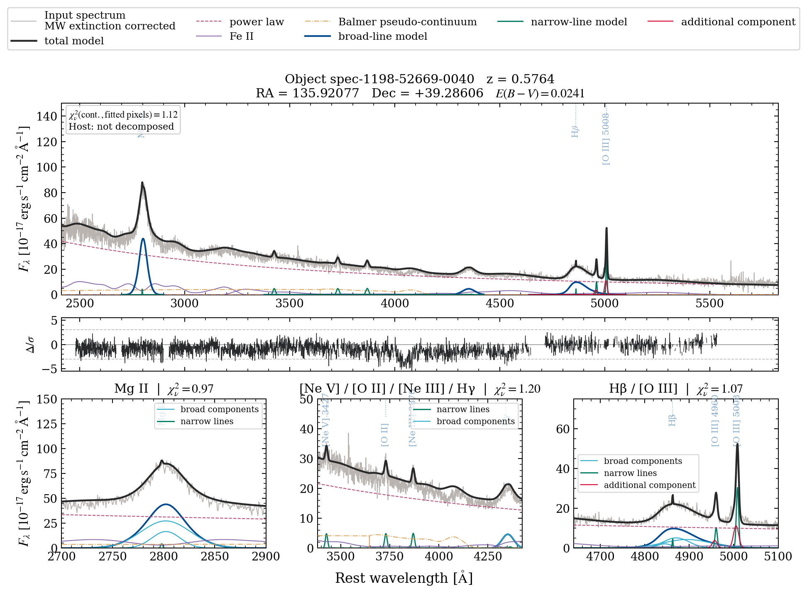

Reading QA plots
====================

Use the quality-assessment (QA) figure to compare the fitted profile with the
data, then check the status and diagnostics of the quantity you want to use.
The figure shows the model across the input grid and marks the pixels used by
the fit. Start with the :doc:`results` guide if you are reading the SDSS example.

Assess the relevant measurement
-----------------------------------

Several checks contribute to the assessment; they answer different questions.

.. list-table::
   :header-rows: 1
   :widths: 31 69

   * - Question
     - Evidence to inspect
   * - Did the continuum optimization complete?
     - ``result.continuum_success`` is the boolean ``result.continuum.success``
       returned by the continuum fitting path. It reports completion of that
       fit, not the adequacy of every line profile.
   * - Did the relevant complex fit?
     - Its entry in ``complex_statuses`` and its separate ``success`` flag.
       Coverage and optimizer messages explain a missing or failed fit.
   * - Does the model describe the data?
     - Unsmoothed residuals on fitted pixels, coverage, parameters at bounds
       and recipe-specific diagnostics. Adaptive [O III] records component
       selection and remaining coherent doublet residuals.
   * - Is a feature detected?
     - Its flux/error, coverage and applicable recipe detection criteria.
       A successful optimizer or a visible model component alone is not a
       detection criterion. Identify the error model before using a flux S/N.
   * - Is the measurement usable for this analysis?
     - Its component definition, uncertainty availability, resolution
       treatment and sensitivity to the continuum or host model.
   * - Does a physical interpretation follow?
     - Additional evidence appropriate to that interpretation. Gaussian
       components describe a profile; a fitted wing alone does not establish
       an outflow, a systemic velocity or a separate emitting region.

There is no universal pass/fail rule for every quantity. A warning may concern
one component or uncertainty assumption while other measurements remain
useful. The :doc:`../reference/warnings` gives actions for named warnings;
:doc:`../science/coverage_reliability` explains coverage statuses.

The SDSS worked example
---------------------------

   Recorded fit of SDSS ``spec-1198-52669-0040.fits`` at input
   :math:`z=0.5764288`, with Galactic foreground correction and no host
   decomposition. Wavelength and flux density use the rest-frame convention.
   The overview and zooms compare the global continuum and line profiles with
   the data; residuals use the fitted valid pixels. See the
   :doc:`../getting_started/quickstart` for input identity and provenance.

The recorded run has a successful continuum fit and a fitted Hβ/[O III]
complex. Its ``oiii_observed_profile_resolution_unavailable`` warning means
that instrumental broadening is included in the measured [O III] profile.
This matters when interpreting a narrow width: supply a supported
object-specific resolution model for an intrinsic-width analysis. Optimizer
completion and the observed-profile measurement answer separate questions.
The :doc:`results` continuation reports broad Hβ and its statistical error.

Diagnose a profile
----------------------

The following situations are hypothetical teaching examples, not features
attributed to the SDSS figure above. Compare alternatives using the same
valid pixels and inspect how the desired measurement changes.

Structured residuals under a broad line
~~~~~~~~~~~~~~~~~~~~~~~~~~~~~~~~~~~~~~~~~~~

Several adjacent residuals of the same sign suggest a mismatch in profile
shape, continuum placement or absorption treatment. Inspect the unsmoothed
line zoom and component sum, including nearby blended lines. Compare a
supported alternative profile or continuum on the same pixels and report
the measurement sensitivity. Adding a component has to follow the applicable
selection rule; it does not by itself identify a physical region.

Broad residual structure near iron emission
~~~~~~~~~~~~~~~~~~~~~~~~~~~~~~~~~~~~~~~~~~~~~~~

Residuals extending over several iron features may reflect the template,
its broadening, continuum curvature or flux calibration. Check whether the
affected wavelengths actually constrained the continuum and whether they lie
near a template boundary. Compare an appropriate iron template or continuum
choice before assigning the residual to a new emission line. See
:doc:`../science/continuum_model`.

A width or velocity at a bound
~~~~~~~~~~~~~~~~~~~~~~~~~~~~~~~~~~

A bound warning means the optimizer reached an allowed limit. The data may
prefer a value beyond it, or several components may trade width and flux
without changing their sum much. Inspect the named parameter and the full
profile, then compare a scientifically motivated alternative model or bound
in a separate fit. A local symmetric covariance error does not measure this
model sensitivity.

A missing line output
~~~~~~~~~~~~~~~~~~~~~~~~~

First check the recipe's coverage and status: the line may be outside the
range, have a masked core, be omitted by component selection, or belong to a
failed fit. An unavailable uncertainty is a separate condition from a
missing value. Missing coverage, fit failure and nondetection do not imply
zero line flux or supply a calibrated upper limit. Use an upper-limit
procedure with an explicit assumed profile when that is the required result.

A line close to instrumental resolution
~~~~~~~~~~~~~~~~~~~~~~~~~~~~~~~~~~~~~~~~~~~

A narrow observed profile can be dominated by the line-spread function (LSF).
Inspect the resolution metadata and intrinsic-width/unresolved flags. Use a
supported LSF when available; report the observed width or an unavailable
intrinsic width when the data do not separate the two. A precise observed
width need not imply a precise intrinsic width.

An EW that changes with host treatment
~~~~~~~~~~~~~~~~~~~~~~~~~~~~~~~~~~~~~~~~~~

A large change in equivalent width (EW) can arise from its continuum
denominator, stellar absorption under the line, or an unstable host
decomposition. Compare the selected line flux, the actual EW continuum and
the host diagnostics, using the same EW convention in both fits. Assess
host/model sensitivity separately from the conditional statistical error;
enabling host fitting alone does not validate every host-derived quantity.
See :doc:`../science/measurements` and
:doc:`../science/uncertainties`.

Overview
------------

- Thin grey: all input pixels with finite wavelength and flux, including
  excluded pixels. Milky Way extinction correction is identified in the
  legend when applied.
- Optional red crosses: excluded input pixels with finite wavelength and flux, including
  flagged pixels and pixels with unusable uncertainties. NaN/Inf flux cannot
  be placed on the plot. These points do not enter residuals or fit statistics.
- Darker grey: input spectrum smoothed for display when the input has more
  than 4,000 wavelength pixels.
- Solid near-black: total model across the complete input grid wherever its
  evaluation is finite, including excluded pixels.
- Grey shading: pixels masked during the earlier pPXF host fit.
- Hatched blue-grey: selected but failed, truncated, or explicitly unmodelled
  regions.
- Residual strip: :math:`(\mathrm{data}-\mathrm{model})/\sigma` on fitted
  pixels only, with references at zero and :math:`\pm3`.
- When a baseline-anchored polynomial is accepted, an additional signed strip
  shows ``polynomial / baseline power law`` on valid input pixels, with zero
  and the configured fractional limits (default ±10%). Negative corrections
  remain visible even when the overview flux axis starts at zero. Archived
  legacy polynomials without baseline provenance do not receive this strip.

A successful emission-line fit takes display precedence over a pPXF emission
mask. Absorption pixels rejected by the Lyα refit remain marked separately.

Zoom panels
---------------

Zooms show only locally relevant broad, narrow, and wing components. The
optical-blue adaptive complex receives a zoom only when all display lines are
covered. Red-side-only Lyα panels are labeled limited and
continuum-extrapolated.

Excluded input pixels also appear in the normal zoom traces, with the total
model drawn across them. Optional red markers are included in both views.
Fitted or reloaded full-grid model arrays are used directly; missing model
values are left as gaps. Residuals and fit statistics use fitted valid pixels
only. A full-grid model curve does not mean that every displayed pixel
constrained the fit. Lyα absorption masks are labeled separately.

Scaling
-----------

Physical spectra are displayed in
:math:`10^{-17}\,\mathrm{erg}\,\mathrm{s}^{-1}\,\mathrm{cm}^{-2}\,
\mathring{A}^{-1}` regardless of their input ``flux_scale``. This is a
plot-only transformation; fitted values, measurements, and archived arrays
retain their native input scaling. Relative spectra retain relative
:math:`F_\lambda` units.

The horizontal axis is transformed to rest wavelength,
:math:`\lambda_{\rm rest}=\lambda_{\rm obs}/(1+z)`. The plotted input flux
density and uncertainty use the prepared rest-frame normalization,
:math:`F_{\lambda,\rm rest}=(1+z)F_{\lambda,\rm obs}`. Galactic dereddening is
evaluated first at observed wavelengths. The display-only cgs scaling above
does not alter these fitted arrays.

When Lyα is covered but not fitted, the overview upper limit uses the 99.8th
percentile of the unsmoothed displayed data rather than an incomplete model.
Clipped peaks are marked with upward indicators.

Configuration
-----------------

Use :class:`qsospec.GlobalQAPlotConfig` to select raw-plus-smoothed,
smoothed-only, or raw-only display; residuals; fitted-region shading; output
format; and zoom count.

Excluded pixels are drawn as ordinary spectrum pixels by default. Add red
crosses with ``result.plot_qa(mark_excluded_pixels=True)`` or
``result.show_qa(mark_excluded_pixels=True)``. For saved workflow plots use
``GlobalQAPlotConfig(mark_excluded_pixels=True)``. Run bundles accept the same
keyword, for example ``run.plot_qa(object_id, mark_excluded_pixels=True)``.
An explicit keyword overrides the configuration; omitting it uses the
configuration default (``False``). The full-grid model display is unchanged. The shared rendering applies to ``plot_qa()``, ``show_qa()``,
saved workflow QA and QA generated from run bundles. Smoothing and residuals
continue to use valid pixels only. Smoothing is a display choice; assess
residual structure on the unsmoothed fitted pixels.

In notebooks, call ``result.plot_qa()`` for an open Matplotlib figure or
``result.show_qa()`` to display it immediately. Opened run bundles provide the
same methods with an object identifier.
